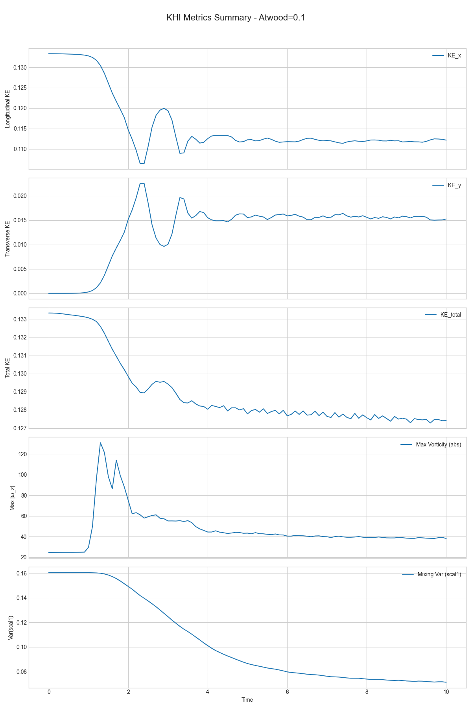
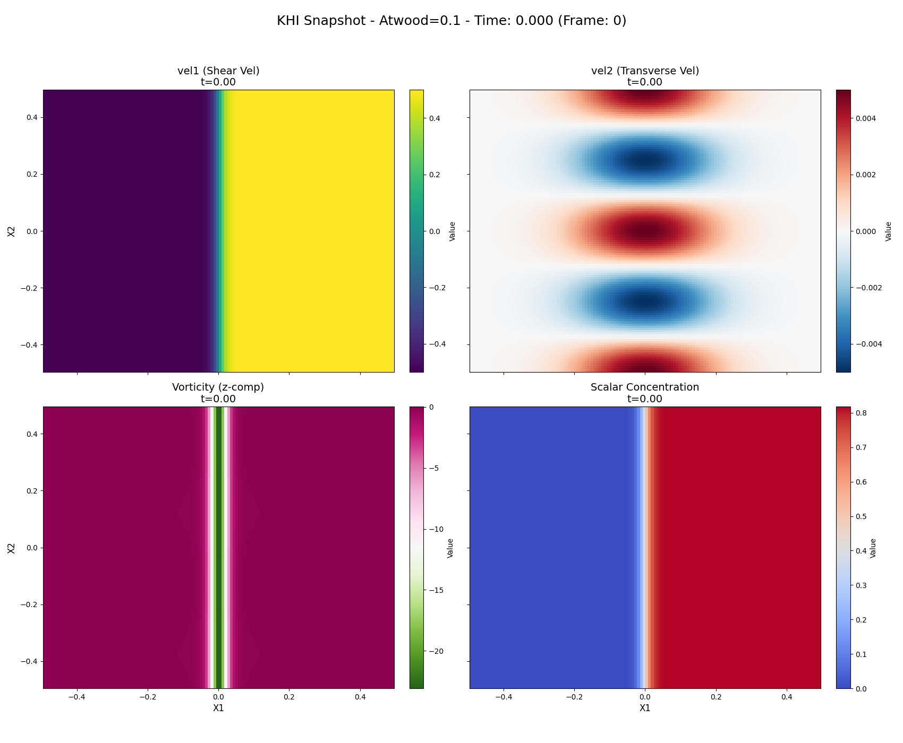
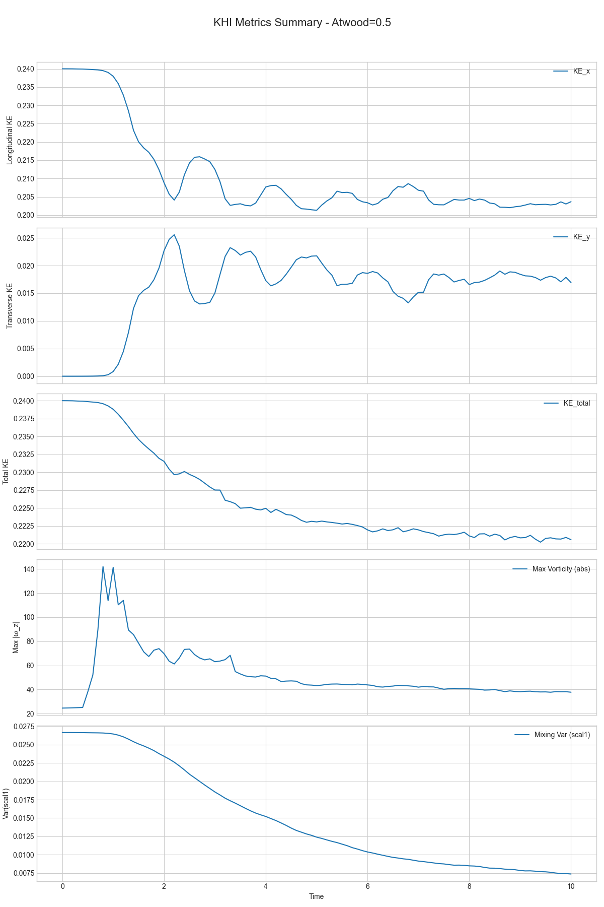
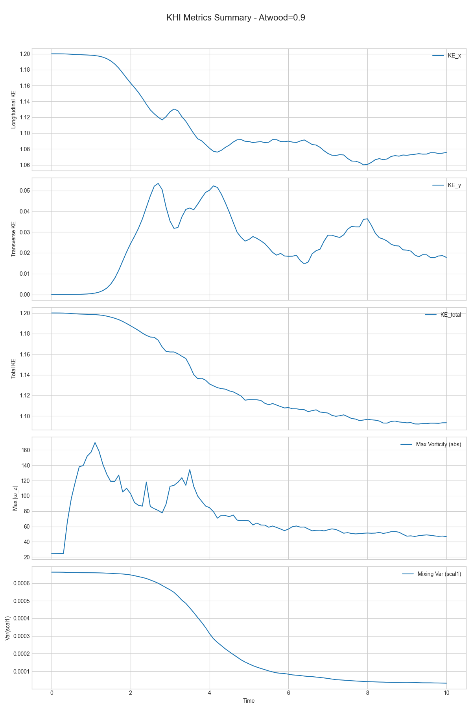

# Kelvin-Helmholtz Instability: Effect of Atwood Number on Nonlinear Evolution

## Overview

This computational study investigates the nonlinear evolution of the Kelvin-Helmholtz instability (KHI) in stratified shear flows, with a focus on how varying the Atwood number ($A = (\rho_h - \rho_l)/(\rho_h + \rho_l)$) affects instability growth, vortex dynamics, and fluid mixing. KHI arises in fluids with velocity shear across a density interface and plays a central role in astrophysical, geophysical, and laboratory flows. Our goal is to quantify the trends in kinetic energy, vorticity, and mixing as a function of Atwood number, and compare them with physical expectations from linear theory and prior nonlinear studies.

## Code Structure and Key Files

This project utilizes a combination of shell scripts, Python scripts for automation and analysis, and C++ for the core simulation code within the Athena++ framework.

-   **`run_kh_sweep.sh`**: Main shell script to orchestrate the parameter sweep. It reads `sweep_config.json`, prepares input files from `inputs/kh_sweep_template.in`, creates output directories, and calls `execute_athena_with_progress.py` to run the Athena++ simulations.
-   **`execute_athena_with_progress.py`**: Python helper script that takes Athena++ commands, executes them, and provides `tqdm` progress bars for both the overall sweep and individual simulation log tailing.
-   **`khi_metrics_analyzer.py`**: Python script for post-processing simulation data. It reads HDF5 outputs, calculates diagnostics (kinetic energies, vorticity, mixing variance), generates plots, and creates movies using FFmpeg.
-   **`sweep_config.json`**: JSON file defining the parameters for each simulation run in the sweep (e.g., Atwood number, density ratio, output directory).
-   **`inputs/kh_sweep_template.in`**: Template for the Athena++ input file. `run_kh_sweep.sh` populates this template with specific parameters for each run.
-   **`src/pgen/kh.cpp`**: The C++ problem generator within Athena++ responsible for setting up the initial conditions for the Kelvin-Helmholtz instability (specifically for `iprob=2`). It reads parameters from the input file to define the density profile, velocity shear, and perturbations.
-   **`khi_metrics_analysis_results/`**: Root directory where all analysis outputs (CSV files, plots, movies) are stored, organized by Atwood number.
-   **`A0.1/`, `A0.5/`, `A0.9/`**: Top-level directories created by `run_kh_sweep.sh` to store the raw output (log files, `.athdf` data files) from each Athena++ simulation run.

## Simulation Setup

### Domain and Numerical Method

- Geometry: 2D Cartesian plane
- Domain size: $x_1, x_2 \in [-0.5, 0.5]$, periodic in both directions
- Resolution: 256 × 256 grid cells
- Hydrodynamics: Ideal adiabatic gas, $\gamma = 5/3$
- Code: Athena++ (pure hydrodynamic mode, no magnetic fields)

### Initial Conditions

The initial conditions are defined through a combination of the Athena++ input file (derived from `inputs/kh_sweep_template.in`) and the C++ problem generator (`src/pgen/kh.cpp`).

**Density**:

- Stratified shear layer centered at $x_2 = 0$, defined by a hyperbolic tangent profile: $\rho(x_2) = \rho_l + 0.5(\rho_h - \rho_l)(1 - \tanh(x_2/\text{width}))$
- Density contrast set by the Atwood number (via `drat` = $\rho_h/\rho_l$) in the input file):
    - $A=0.1 \Rightarrow \rho_h \approx 1.222, \rho_l = 1.0$ (Density ratio `drat` $\approx 1.222$)
    - $A=0.5 \Rightarrow \rho_h = 3.0, \rho_l = 1.0$ (Density ratio `drat` $= 3.0$)
    - $A=0.9 \Rightarrow \rho_h = 19.0, \rho_l = 1.0$ (Density ratio `drat` $= 19.0$)
- Base density $\rho_l = 1.0$ is set in `src/pgen/kh.cpp`.
- Layer width parameter `width = 0.025` (from input file) is used in $\tanh(x_2 / \text{width})$.

**Velocity**:

- Longitudinal velocity $v_1(x_2) = v_{\text{flow}} \tanh(x_2 / \text{width})$, with $v_{\text{flow}} = 0.5$ (hardcoded in `src/pgen/kh.cpp`, `width` from input).
- Transverse perturbation $v_2(x_1, x_2) = \text{amp} \cdot v_{\text{flow}} \cdot \sin(k_x x_1) \cdot \exp(-x_2^2 / \sigma_{\text{pert}}^2)$, where:
    - Perturbation amplitude `amp = 0.01` (from input file).
    - Wavenumber $k_x = 2\pi / \lambda$, with `lambda_param = 1.0` (from input file, corresponds to $m=2$ mode for domain width $L_x=1.0$, so $k_x = (2\pi m)/L_x = 4\pi$).
    - Perturbation y-extent `sigma_pert = 0.1` (from input file).

**Pressure**: Uniform $P = 2.5$ (from input file `press` and $\gamma=5/3$ used to set internal energy).

**Passive Scalar**:

- Used to track fluid mixing, initialized as $s(x_2) = 0.5(1 + \tanh(x_2 / \text{width}))$ in `src/pgen/kh.cpp` if `nscalars > 0`.

### Configuration Snippets

**1. Sweep Configuration (`sweep_config.json`):**
Defines the parameters for each simulation run. Example for one run:
```json
{
  "name": "A0.1",
  "drat": 1.2222222222,
  "athinput_problem_id": "A0.1"
}
```
This is iterated by `run_kh_sweep.sh` to generate specific input files.

**2. Athena++ Input File Template (`inputs/kh_sweep_template.in`):**
Key sections that are either fixed or parameterized:
```athinput
<comment>
problem = kelvin_helmholtz_hydro_2d
</comment>

<job>
problem_id = kh_template  # This will be replaced by script (e.g., A0.1)
</job>

<output1>
file_type  = hdf5         # HDF5 data dump
data_format= %s.out1.%05d.athdf # Primitive variables
dt         = 0.1          # Time increment between outputs
variable   = prim         # Output primitive variables
</output1>

<time>
courant_no = 0.4          # The Courant, Friedrichs, & Lewy (CFL) Number
tlim       = 10.0         # problem time limit
</time>

<mesh>
nx1        = 256          # Number of zones in X1-direction
x1min      = -0.5
x1max      = 0.5
ix1_bc     = periodic
ox1_bc     = periodic

nx2        = 256          # Number of zones in X2-direction
x2min      = -0.5
x2max      = 0.5
ix2_bc     = periodic
ox2_bc     = periodic

nx3        = 1            # Number of zones in X3-direction (dummy for 2D)
x3min      = -0.5
x3max      = 0.5
ix3_bc     = periodic
ox3_bc     = periodic
</mesh>

<hydro>
gamma          = 1.6666666666666667  # gamma = 5/3 for ideal gas
</hydro>

<problem>

# shared hydro KHI params
iprob            = 2        # KH iprob flag for hydro (modified kh.cpp)
amp              = 0.01     # amplitude of perturbations
lambda_param     = 1.0      # wavelength of perturbations (m=2 for Lx=1)
width            = 0.025    # width of the shear layer
sigma_pert       = 0.1      # y-extent of initial vy perturbation

# density ratio for this run (this will be replaced by script)
drat             = 1.2222222222 

press            = 2.5      # Initial pressure

# Passive scalar
nscalars         = 1        # Number of passive scalars
```

**3. C++ Problem Generator (`src/pgen/kh.cpp`):**
Located at `src/pgen/kh.cpp`, this file contains the C++ code that Athena++ uses to set up the initial physical state of the simulation grid when `iprob=2` is specified in the input file. It reads parameters like `drat`, `amp`, `width`, `lambda_param`, `sigma_pert`, and `press` from the `<problem>` block of the input file. 

Conceptual logic within `kh.cpp` for `iprob=2`:
- Reads parameters using `pin->GetReal("problem", "parameter_name")`.
- Calculates $\rho_h$ from `drat` (assuming $\rho_l=1.0$).
- Loops over grid cells (i, j, k) and their coordinates (x1, x2, x3).
- Sets density $\rho$ based on the hyperbolic tangent profile using `width` and $x_2$.
- Sets longitudinal velocity $v_1$ based on $\tanh(x_2 / \text{width})$ and $v_{\text{flow}}=0.5$.
- Sets transverse velocity perturbation $v_2$ using `amp`, $v_{\text{flow}}$, `lambda_param` (to get $k_x$), and `sigma_pert`.
- Sets $v_3 = 0$.
- Sets pressure (or internal energy based on `press` and $\gamma$).
- If `nscalars > 0`, initializes the first passive scalar $s_0$ based on $\tanh(x_2 / \text{width})$.
- Stores these primitive variables (rho, P, v1, v2, v3, s0) into the hydrodynamics and passive scalar arrays of Athena++.

## Diagnostics Tracked

1.  **Longitudinal Kinetic Energy** $KE_x = \int (1/2) \rho v_1^2 dV$
2.  **Transverse Kinetic Energy** $KE_y = \int (1/2) \rho v_2^2 dV$
3.  **Total Kinetic Energy** $KE_{\text{total}} = KE_x + KE_y$
4.  **Max Vorticity** $|\omega_z|_{\text{max}} = |\partial_{x_1} v_2 - \partial_{x_2} v_1|_{\text{max}}$, where $\omega_z$ is the z-component of vorticity.
5.  **Mixing Variance of Scalar** $\sigma_s^2 = \langle s^2 \rangle - \langle s \rangle^2$, where $s$ is the passive scalar concentration and $\langle \cdot \rangle$ denotes a volume average. (Note: The analysis script uses `np.var()` which calculates $\langle (s - \langle s \rangle)^2 \rangle = \langle s^2 \rangle - \langle s \rangle^2$).

These were tracked over time for each Atwood number case.

## Results and Interpretation

This section highlights the key findings from simulations with Atwood numbers A=0.1, A=0.5, and A=0.9.

### Case A = 0.1

- **KE_y**: Very weak growth, consistent with slow KHI development at low density contrast. The instability takes longer to pick up significant transverse momentum.
- **Vorticity**: Modest peak values, indicative of mild vortex roll-up. The shear layer deforms but does not produce intense, compact vortices quickly.
- **Mixing**: Limited — scalar variance declines only gradually. The weak instability results in slow entrainment and mixing of the two fluids.
- **KE_total**: Well conserved, indicating minimal numerical dissipation and that most energy remains in the mean flow or slowly transfers to perturbations.
- **Interpretation**: Weak density contrast (A=0.1) results in a slowly developing, weak instability with limited vortex formation and slow mixing, dominated by the initial shear flow.

**Visual Results for A=0.1:**

**Summary Metrics:**


**Evolution Movie:**
[](khi_metrics_analysis_results/A0.1/movie_KHI_A0.1.mp4)
*(Click the thumbnail to play the video for A=0.1. Direct link: [movie_KHI_A0.1.mp4](khi_metrics_analysis_results/A0.1/movie_KHI_A0.1.mp4))*

### Case A = 0.5

- **KE_y**: Clear exponential growth phase followed by saturation, characteristic of well-developed KHI. Significant energy is transferred to transverse motions.
- **Vorticity**: Strong peaks, indicating the formation of distinct, coherent vortices. The roll-up is much more pronounced than in the A=0.1 case.
- **Mixing**: Efficient — scalar variance drops steadily and significantly as vortices stir and entrain fluid from both layers.
- **KE_total**: Shows a moderate decay after the initial growth phase, likely due to increased shear at the edges of the rolled-up vortices and some numerical dissipation as structures become more complex.
- **Interpretation**: A=0.5 exhibits physically robust nonlinear KHI behavior, with clear vortex roll-up, saturation, and efficient mixing driven by large-scale vortex dynamics.

**Visual Results for A=0.5:**

**Summary Metrics:**


**Evolution Movie:**
[](khi_metrics_analysis_results/A0.5/movie_KHI_A0.5.mp4)
*(Click the thumbnail to play the video for A=0.5. Direct link: [movie_KHI_A0.5.mp4](khi_metrics_analysis_results/A0.5/movie_KHI_A0.5.mp4))*

### Case A = 0.9

- **KE_y**: Strong and rapid growth, potentially leading to more complex nonlinear modulations such as vortex pairing or the development of secondary instabilities due to the high-density contrast. Saturation occurs at a high level of transverse energy.
- **Vorticity**: Reaches very high peak values, consistent with the formation of thin, tightly rolled-up shear layers characteristic of high Atwood number KHI. Mushroom-like structures are prominent.
- **Mixing**: Extremely rapid and efficient — the scalar field becomes homogenized (variance drops close to zero) relatively early in the simulation (e.g., by $t \sim 6-8$), indicating the strong churning action of the instability.
- **KE_total**: Shows a steeper decay compared to lower Atwood numbers. This suggests that more energy is expended in deforming the significantly denser fluid and is potentially lost to smaller scales or numerical effects due to sharper gradients.
- **Interpretation**: High Atwood number (A=0.9) leads to a highly asymmetric instability where the lighter fluid penetrates deeply into the heavier fluid. This results in very strong vortex formation, highly efficient mixing, and potentially more complex turbulent dynamics.

**Visual Results for A=0.9:**

**Summary Metrics:**


**Evolution Movie:**
[](khi_metrics_analysis_results/A0.9/movie_KHI_A0.9.mp4)
*(Click the thumbnail to play the video for A=0.9. Direct link: [movie_KHI_A0.9.mp4](khi_metrics_analysis_results/A0.9/movie_KHI_A0.9.mp4))*

## Conclusion

The simulation results confirm well-established physical trends in the nonlinear development of the Kelvin-Helmholtz instability:

- Higher Atwood number generally leads to faster initial growth rates of transverse kinetic energy, stronger peak vorticity, more asymmetric vortex structures (with the lighter fluid forming "mushroom caps" intruding into the heavier fluid), and more rapid and thorough mixing of the passive scalar.
- Kinetic energy is progressively converted from the initial longitudinal shear flow into transverse motions associated with the vortices. The total kinetic energy tends to decrease over time, especially at higher Atwood numbers, as energy is dissipated through increasingly complex flow structures or converted into thermal energy (though the latter is not directly tracked in detail here beyond its effect on pressure).
- The passive scalar variance provides a useful quantitative measure of mixing, correlating strongly with the growth of vorticity and transverse kinetic energy. The homogenization of the scalar field is a clear indicator of the late nonlinear stages of the KHI.

These simulations, now at 256x256 resolution, provide a good qualitative and quantitative look into the effect of density contrast on KHI. Future directions could include a more detailed spectral analysis to identify dominant modes and energy transfer, exploring the effects of compressibility in more detail (e.g., higher Mach numbers), and extending the study to include magnetic fields (MHD KHI) or three-dimensional effects.

--- 